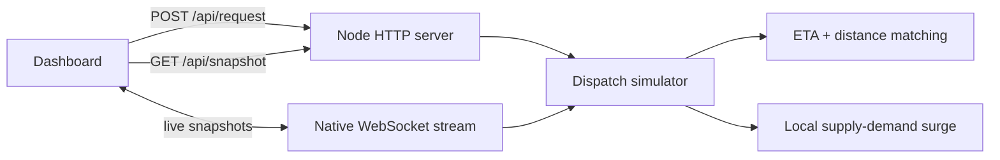

# Ride Dispatch Simulator

A real-time ride dispatch simulator built for a software engineering internship portfolio. It models driver supply, rider demand, ETA-based matching, surge pricing, live trip state, and dispatch latency.

## Why this project fits an Uber SWE application

- Geospatial matching with Haversine distance and ETA scoring.
- Real-time state propagation over WebSockets.
- Supply-demand based surge pricing by local area.
- Trip state machine: waiting, matched, picking up, on trip, completed, cancelled.
- Load testing that reports throughput and p95 dispatch latency.
- Browser dashboard that visualizes drivers, riders, active trips, and surge pressure.

## Tech stack

- JavaScript / Node.js
- Native HTTP server
- Native WebSocket protocol implementation
- HTML5 Canvas
- CSS Grid and responsive UI
- GitHub / Git

## Benchmark

Measured locally with `DRIVERS=10000 REQUESTS=10000 npm run load`.

| Metric | Result |
| --- | ---: |
| Simulated drivers | 10,000 |
| Simulated ride requests | 10,000 |
| Matched requests | 9,983 |
| Match rate | 99.83% |
| Throughput | 770 requests/sec |
| p95 dispatch latency | 0.12 ms |
| Average ETA | 1 min |

## Run locally

```bash
npm start
```

Open `http://localhost:3000`.

## Test and load test

```bash
npm test
npm run load
```

Optional larger run:

```bash
DRIVERS=10000 REQUESTS=10000 npm run load
```

## Architecture



## Resume bullet

Built a real-time ride dispatch simulator with WebSocket telemetry, geospatial ETA-based matching, dynamic surge pricing, and load tests simulating thousands of drivers and ride requests while tracking p95 dispatch latency.

## Future improvements

- Replace linear nearby-driver scans with Redis GEO or an S2/geohash index.
- Persist historical trip and dispatch metrics in Postgres.
- Add OpenTelemetry traces around dispatch scoring.
- Add replayable traffic scenarios for deterministic benchmark comparisons.
